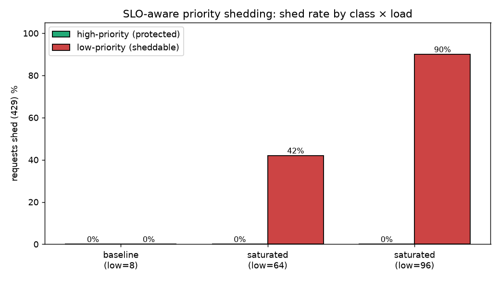
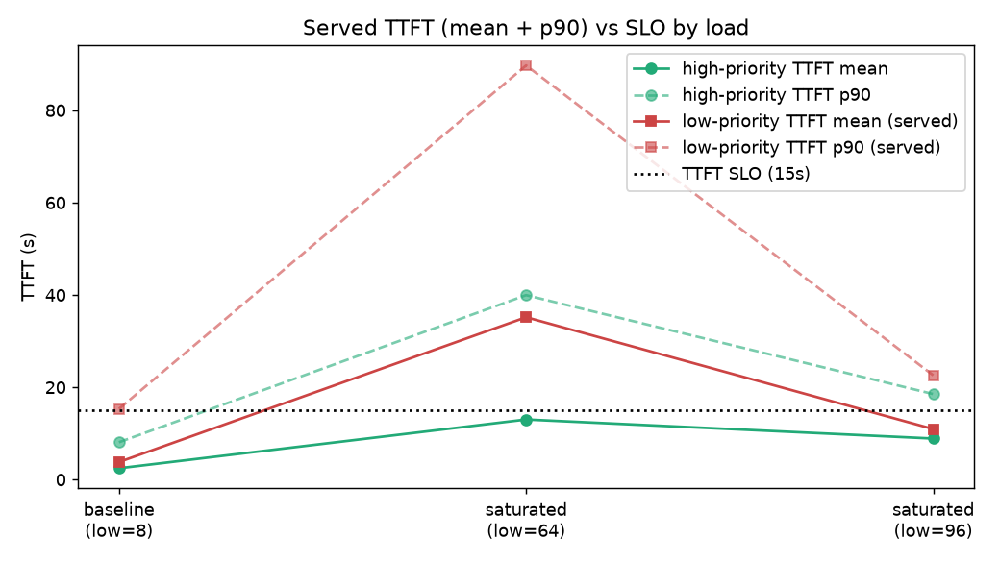

# SLO-Aware Priority Shedding on llm-d — Summary

**What this shows:** on a shared, saturated inference pool, llm-d can **protect a high-priority
("premium") traffic tier by shedding a low-priority ("best-effort") tier** — driven by
per-request latency SLOs, decided at the router (EndpointPicker / EPP) before requests reach
the model servers. Demonstrated on Mistral-Medium-3.5-128B serving a realistic multi-turn
agentic workload.

---

## TL;DR

| | Baseline (headroom) | Saturated (low=64) | Saturated (low=96) |
|---|---|---|---|
| **high-priority shed** | 0% | **0%** | **0%** |
| **low-priority shed** | 0% | **42%** | **90%** |

- **High-priority is never shed**; **low-priority shedding rises with load** (0 → 42 → 90%).
- **100% of shedding is SLO-driven** (verified: every shed = "no endpoint can meet this
  request's SLO"; the generic utilization-backpressure path was disabled and fired 0 times).
- High-priority mean time-to-first-token (TTFT) **stays within the 15s SLO at every load**;
  low-priority crosses above it under saturation. Shedding the best-effort flood frees
  capacity for premium.

---

## Setup

| | |
|---|---|
| **Model / hardware** | `mistralai/Mistral-Medium-3.5-128B`, 3 replicas × TP8 = 24× H100-80GB, 256K context |
| **Workload** | Agentic `conversation_replay` (inference-perf): 3K shared + 15–100K-token per-conversation system prompt, ~6 turns/conversation, ~1.5K-in / 0.8K-out per turn — heavy cross-turn cache reuse, long prefills |
| **Priority tiers** | `high-priority` (priority 10) and `low-priority` (priority −10), selected per request via the `x-llm-d-inference-objective` header → an `InferenceObjective` CR |
| **SLO** | Per request: `x-llm-d-slo-ttft-ms: 15000`, `x-llm-d-slo-tpot-ms: 40` (+ `stream: true`) |
| **Router** | Predicted-latency EPP: load/prefix-aware routing + an online XGBoost latency predictor; the `latency-slo-admitter` plugin sheds sheddable (priority<0) requests when no endpoint is predicted to meet the SLO |
| **Capacity knee (C_sat)** | ≈ 32 concurrent (from a calibration ramp) |

**How priority is set:** there is no numeric priority header — a request sends
`x-llm-d-inference-objective: <name>`, and the EPP looks up that `InferenceObjective` in the
pool's namespace for its `priority`. Negative priority = "sheddable."

---

## Results

### Shedding by load

| Phase | low offered conc | high shed | low shed | sheds: SLO-path / util-path |
|---|---|---|---|---|
| Baseline | 8 (total 16 < C_sat) | 0% (0/48) | 0% (0/48) | 0 / 0 |
| Saturated | 64 | 0% (0/96) | 42% (163/384) | 163 / 0 |
| Saturated | 96 | 0% (0/144) | 90% (1793/2000) | 1793 / 0 |

The SLO-path rejection count equals the low-priority failure count exactly in every phase,
and the utilization path fired 0 times — so shedding is cleanly attributable to the SLO.

### Served latency (mean + p90) vs SLO

We report the **mean** (and p90): the predictor is trained with a `mean` objective, so the
SLO is effectively a guarantee on the mean — that's the metric to hold against the SLO line.

| Phase | high mean | high p90 | low mean (served) | low p90 |
|---|---|---|---|---|
| Baseline (low=8) | 2.5s | 8.1s | 3.8s | 15.3s |
| Saturated (low=64) | **13.0s** | 40.0s | 35.2s | 89.7s |
| Saturated (low=96) | **8.9s** | 18.5s | 11.0s | 22.6s |

- **High-priority mean TTFT < 15s SLO at every load.** Never shed.
- **Low-priority mean exceeds the SLO under saturation** (35s at low=64). At low=96 it drops
  to 11s only because 90% is shed, leaving a few cheap survivors that queue less — not because
  service improved.
- **The protection regime shifts with load.** At moderate saturation (low=64) shedding 42% of
  low frees enough capacity that premium is *also* much faster (13s vs 35s). At heavy
  saturation (low=96) the residual admitted load saturates the pool for everyone and the means
  converge (8.9 vs 11.0s) — protection is then almost entirely via **admission** (0% vs 90%
  shed), not latency.

---

## How the protection works

The differentiation is **not** in-pool priority scheduling (no priority scorer; the model
server batches FCFS). It comes from **asymmetric admission throttling → a capacity/queuing
differential**: the admitter throttles low-priority (preferentially dropping the
expensive, SLO-missing requests) but never high-priority, so the light premium stream keeps
finding free capacity while the heavy best-effort stream queues. In one line: **shedding the
best-effort flood frees exactly the capacity premium needs.**

The admitter rejects a sheddable request only when **no endpoint** can meet its SLO **and** no
endpoint is idle or cold (work-conserving — it won't reject when there's any slack). So
shedding requires genuine, sustained saturation.

---

## Caveats / notes (read before reusing these numbers)

- **The guarantee is on the predicted *mean*, not the tail.** A p90/p99 above SLO is expected,
  not a defect; the high-priority *mean* is the success metric and stays < 15s. For a true
  tail guarantee you'd train the predictor on a percentile objective and/or add a
  routing-level SLO-headroom filter or flow-control priority queuing (omitted here to isolate
  the admitter).
- **Protection is on *admission*, not queue position.** Under heavy load premium is "never
  rejected," not "always fast" — its large prompts still queue FCFS.
- **Baseline isn't guaranteed 0%.** With inputs spanning 3K–100K tokens, the largest prompts
  hit 16–22s TTFT even at low load and exceed the 15s SLO on their own — so they're shed
  regardless of pool load (re-runs showed ~17–19%). That's **long-input-driven**, genuine
  (verified predicted 16–22s vs served actual p90 14.6s), not predictor error. A single fixed
  TTFT SLO can't cleanly separate baseline from saturated when prompt sizes vary this much.
- **TPOT predictions are noisy** (predicted 41–86ms vs actual ~10–17ms at light load), so a
  tight TPOT SLO (40ms) adds spurious sheds. Use TTFT as the primary SLO and a high TPOT
  guardrail (~200ms).
- **Two shedding paths exist.** The SLO admitter *and* a generic utilization detector (KV≥80%
  OR queue≥5). To attribute shedding solely to the SLO we neutralized the utilization path
  (`kvCacheUtilThreshold: 1.0`, `queueDepthThreshold: 100`).
- **Config gotcha:** the `InferenceObjective` `poolRef.group` must match the InferencePool's
  group (`inference.networking.k8s.io`); a mismatch silently resolves priority to 0 → nothing
  is ever shed.
- **Methodology:** a heavily-shed flood (instant rejections) drains faster than the slow
  long-context premium stream, so the flood must be sized to *outlast* premium for a valid
  overlap; the predictor must be warmed on fresh (cache-miss) traffic, and re-warmed after any
  EPP restart.

---

## Reproduce / artifacts

Everything is in [`guides/slo-priority-shedding/`](.): the well-lit-path guide (router values,
priority objectives, Mistral model-server overlay, GKE monitoring) and
[`experiment/`](experiment/) (design, runbook, inference-perf configs, `results/` with the
raw data + charts, and the full [RESULTS.md](experiment/RESULTS.md)).
